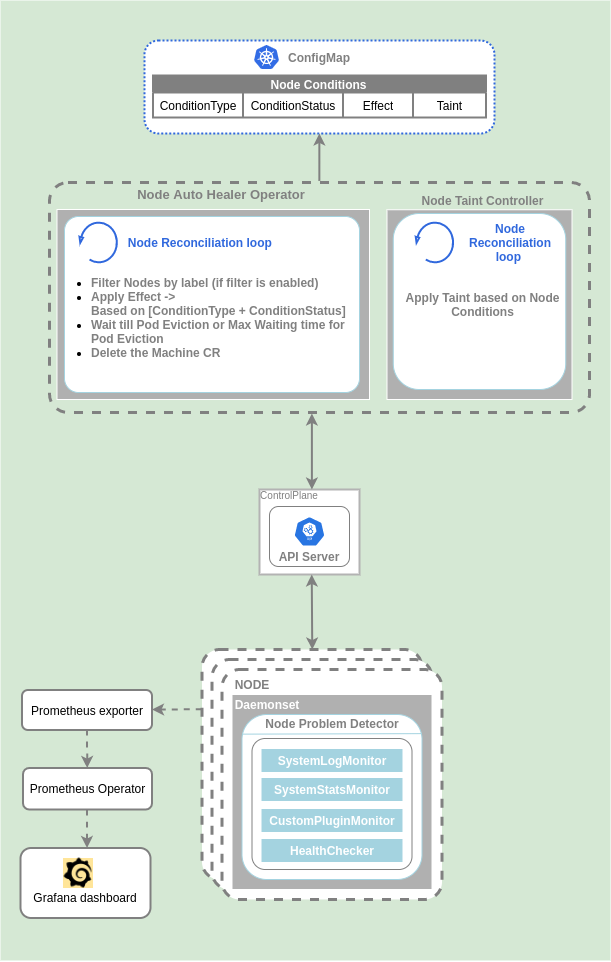

# JARVIS
Machine auto healer!


## Problem


For a kubernetes cluster to remain in a healthy state, all the nodes should remain in a healthy, running state.


## Solution


- Machine auto healer operator will always try to keep the nodes (machines)
  in your cluster in a healthy, running state.
- It will perform periodic checks on the health state of each node (machine) in your cluster.
- If a node (machine) fails consecutive health checks over an extended time period,
  it will initiate a repair process for that node (machine).




##### Node Conditions
- The conditions field describes the status of all Running nodes.
- By describing any node we can see the NodeCondition and its respective status
  ```bash
  Conditions:
  Type             Status  LastHeartbeatTime                 LastTransitionTime                Reason                       Message
  ----             ------  -----------------                 ------------------                ------                       -------
  MemoryPressure   False   Sat, 10 Apr 2021 02:23:21 +0530   Fri, 09 Apr 2021 15:44:18 +0530   KubeletHasSufficientMemory   kubelet has sufficient memory available
  DiskPressure     False   Sat, 10 Apr 2021 02:23:21 +0530   Fri, 09 Apr 2021 15:44:18 +0530   KubeletHasNoDiskPressure     kubelet has no disk pressure
  PIDPressure      False   Sat, 10 Apr 2021 02:23:21 +0530   Fri, 09 Apr 2021 15:44:18 +0530   KubeletHasSufficientPID      kubelet has sufficient PID available
  Ready            True    Sat, 10 Apr 2021 02:23:21 +0530   Fri, 09 Apr 2021 15:45:45 +0530   KubeletReady                 kubelet is posting ready status

  ```
- Following are the NodeConditions by default supported by K8s cluster.
  
  
  | ConditionType      | Condition Status   |Effect        | Key      |
  | ------------------ | ------------------ | ------------ | -------- |
  |Ready               |True                | -            | |
  |                    |False               | NoExecute    | node.kubernetes.io/not-ready           |
  |                    |Unknown             | NoExecute    | node.kubernetes.io/unreachable         |
  |OutOfDisk           |True                | NoSchedule   | node.kubernetes.io/out-of-disk         |
  |                    |False               | -            | |
  |                    |Unknown             | -            | |
  |MemoryPressure      |True                | NoSchedule   | node.kubernetes.io/memory-pressure     |
  |                    |False               | -            | |
  |                    |Unknown             | -            | |
  |DiskPressure        |True                | NoSchedule   | node.kubernetes.io/disk-pressure       |
  |                    |False               | -            | |
  |                    |Unknown             | -            | |
  |NetworkUnavailable  |True                | NoSchedule   | node.kubernetes.io/network-unavailable |
  |                    |False               | -            | |
  |                    |Unknown             | -            | |
  |PIDPressure         |True                | NoSchedule   | node.kubernetes.io/pid-pressure        |
  |                    |False               | -            | |
  |                    |Unknown             | -            | |


- `Node Probelm Detector`
  - By default, k8s support limited set of NodeConditions. 
  - We can use [node-problem-detector](https://github.com/kubernetes/node-problem-detector) which runs as a DaemonSet and collects different node problems and reports them in form of NodeConditions.
  
- Based on the NodeCondition's we can apply taint effects such as
  - `NoSchedule`: Does not allow new pods to schedule onto the node unless they tolerate the taint. Does not interrupt already running pods.
  - `PreferNoSchedule`: Scheduler tries not to schedule new pods onto the node.
  - `NoExecute`: Evicts any already-running pods that do not tolerate the taint. 
  

## Node Taint Controller(NTC)
- NTC control loop will continuously look for `node conditions` of all nodes and will apply taint based on the `condition` type. 

## Node Auto Healer Operator(NAHO)
- Will reconcile all Nodes, look for applied `taints` on each node and apply taint effect based on the taint type on that node.
- Next, it will evict all the pods from that Node.
- Once all the pods are evicted from that Node or else it extends the default eviction period, it will delete that Node(Machine) resource.